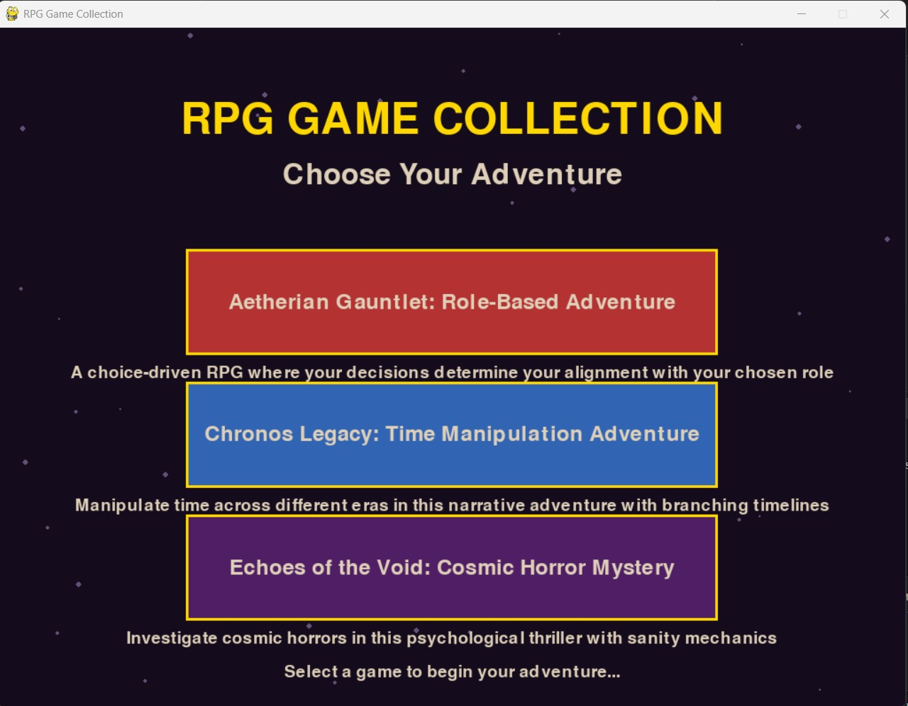

# RPG Game Collection

A collection of three choice-driven narrative RPG games built with Python and Pygame, each offering unique gameplay mechanics and storytelling experiences.

## Games Included

### 1. Aetherian Gauntlet: Role-Based Adventure
A gladiator arena RPG where your choices determine how well you align with your chosen role.

**Features:**
- Choose between Warrior, Mage, or Rogue paths
- 4 challenging scenarios with moral dilemmas
- Alignment system that tracks your adherence to your role's values
- Multiple endings based on your choices
- Honor, Pragmatism, and Curiosity trait tracking

### 2. Chronos Legacy: Time Manipulation Adventure
Travel through different eras as a Time Weaver to restore balance to the timeline.

**Features:**
- Journey through Present, Past, and Future eras
- Timeline Integrity system (0-100%)
- Choices affect the flow of history
- Multiple time-based scenarios with consequences
- Endings determined by how well you preserve the timeline

### 3. Echoes of the Void: Cosmic Horror Mystery
Investigate a space station where cosmic entities threaten reality itself.

**Features:**
- Sanity system (0-100%) affected by your choices
- Atmospheric cosmic horror storytelling
- 4 investigation scenarios with escalating stakes
- Multiple endings based on your mental state
- Particle effects and dark atmosphere

## Requirements

- Python 3.7+
- Pygame 2.0+

## Installation

1. Make sure Python is installed on your system
2. Install Pygame:
```bash
pip install pygame
```

3. Download the game file (`rpg_game_collection.py`)
4. Run the game:
```bash
python rpg_game_filename.py
```

## Screenshots
 ### Game Dashborad
   

 ### Holdings Chart
 

 ### Holdings Data
 

### Buy Window


## How to Play

### Gameplay Flow
1. **Main Menu**: Choose which of the three games to play
2. **Character Selection** (Aetherian Gauntlet): Choose your role
3. **Scenarios**: Read the situation and make choices by clicking buttons
4. **Endings**: See the results of your decisions
5. **Return**: Use "Return to Menu" to play other games

### Game Mechanics

#### Aetherian Gauntlet
- Each role (Warrior/Mage/Rogue) has preferred traits
- Your choices add points to Honor, Pragmatism, or Curiosity
- Final judgment based on alignment percentage with your chosen role
- 70%+ alignment = True Adept ending
- Below 70% = Aberration ending

#### Chronos Legacy
- Timeline Integrity starts at 100%
- Preservation choices maintain/increase integrity
- Intervention choices decrease integrity
- Knowledge choices gather information without major impact
- Final ending based on integrity level

#### Echoes of the Void
- Sanity starts at 100%
- Destructive choices maintain sanity
- Using alien power decreases sanity significantly
- Studying artifacts has moderate sanity cost
- Multiple endings based on final sanity level

## Tips for Players

- **Read carefully**: Each scenario provides context for your decisions
- **Stay in character**: For Aetherian Gauntlet, make choices that align with your role
- **Consider consequences**: In Chronos Legacy and Echoes of the Void, your choices affect the world
- **Experiment**: Each game offers multiple playthroughs with different outcomes
- **Try all paths**: Each role and choice combination offers unique experiences

## Technical Features

- **Dynamic UI**: Buttons auto-size to content
- **Progress Tracking**: Visual meters for integrity/sanity
- **Multiple Screens**: Seamless navigation between game states
- **Choice Consequences**: Branching narratives based on decisions

## Game Structure

```
Main Menu
├── Aetherian Gauntlet
│   ├── Role Selection (Warrior/Mage/Rogue)
│   ├── 4 Scenarios
│   └── Final Judgment
├── Chronos Legacy
│   ├── 3 Time Periods
│   └── Timeline Ending
└── Echoes of the Void
    ├── 4 Investigation Scenarios
    └── Sanity-Based Ending
```

## Development Notes

- Built with Pygame for cross-platform compatibility
- Modular design allows easy addition of new games
- Clean separation between game logic and display
- Extensible choice system for future content

## Troubleshooting

**Game won't start:**
- Ensure Python and Pygame are properly installed
- Check that all imports are successful

**Buttons not responding:**
- Make sure you're clicking directly on the button text
- Try clicking different areas of the button

## Credits

Developed using Python 3 and Pygame library. Features original storylines and game mechanics designed for replayable narrative experiences.

---

*Embark on three unique adventures where every choice matters and every playthrough tells a different story.*
